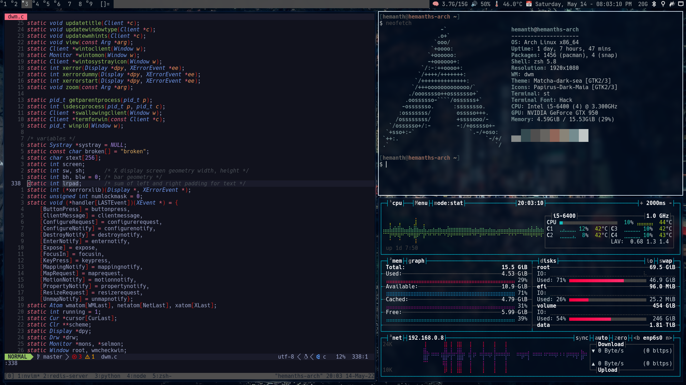

<p align="center">
    
    &nbsp
    &nbsp
    &nbsp
    &nbsp
</p>

<table>
    <tr>
        <td>Operating System</td>
        <td>Arch Linux</td>
    </tr>
    <tr>
        <td>Window Manager</td>
        <td>DWM</td>
    </tr>
    <tr>
        <td>Editor</td>
        <td>Vim</td>
    </tr>
    <tr>
        <td>Shell</td>
        <td>zsh</td>
    </tr>
    <tr>
        <td>Terminal Emulator</td>
        <td>ST</td>
    </tr>
    <tr>
        <td>File Manager</td>
        <td>Ranger</td>
    </tr>
    <tr>
        <td>PDF Reader</td>
        <td>Zathura</td>
    </tr>
</table>

My entire workflow is driven in the spirit of Vim.

### Vim

I have two sets of configurations available for Neovim. One is written entirely
in [VimScript](./old/nvim.init.vim). The other, is the one that I am currently
using written in [Lua](./nvim).

**I always use the latest Nightly build**, so some features may not work if you
install previous builds/stable releases and intend to use my configuration.

Make sure that you have Git installed.

#### Lua

[Packer.nvim](https://github.com/wbthomason/packer.nvim) for plugin management.

#### VimScript

To install in Arch :

```
sudo pacman -S neovim
```

I would recommend the following plugin managers:
Personally, I used Vim-Plug.

1. [Vim-Plug](https://github.com/junegunn/vim-plug)

- To install in a Windows machine using powershell.

```sh
iwr -useb https://raw.githubusercontent.com/junegunn/vim-plug/master/plug.vim |`
ni "$(@($env:XDG_DATA_HOME, $env:LOCALAPPDATA)[$null -eq $env:XDG_DATA_HOME])/nvim-data/site/autoload/plug.vim" -Force
```

- To install in an Unix environment.

```sh
sh -c 'curl -fLo "${XDG_DATA_HOME:-$HOME/.local/share}"/nvim/site/autoload/plug.vim --create-dirs \
https://raw.githubusercontent.com/junegunn/vim-plug/master/plug.vim'
```

2. [Vundle](https://github.com/VundleVim/Vundle.vim)

- To install in any environment:

```sh
git clone https://github.com/VundleVim/Vundle.vim.git ~/.vim/bundle/Vundle.vim
```
